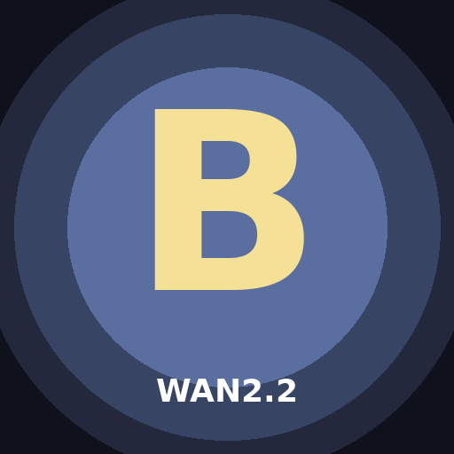

# BASI WAN KENOBI

*Created by [llmsherpa](https://x.com/LLMSherpa) ([@shitcoinsherpa](https://github.com/shitcoinsherpa)) of [BT6](https://bt6.gg).*

[NVIDIA Only] **Wan2.2 video** Studio + LoRA Gym + joint **audio/video (MOVA)** — one app, from **12GB VRAM**.



A one-click [Pinokio](https://pinokio.computer) app for making and training video on consumer NVIDIA GPUs: text/image-to-video, talking characters, restyle, and synchronized audio+video — plus LoRA training for all of it.

## Features

- **Studio — generate & edit video** on the bundled Wan2.2 engine (GGUF Q4 + block-swap for low VRAM):
  - **Text / Image → Video** — Wan2.2-A14B MoE, 4-step Lightning
  - **Continue** — extend the last clip from a chosen final frame, with a Qwen3-VL "suggest next prompt"
  - **Restyle (V2V)** and **Depth-lock / Keyframe edit (VACE)**
  - **Talking character (S2V)** — drive a reference image with an audio track (lip-sync)
  - **MOVA (audio+video)** — text → a styled scene with **synchronized audio**, in your trained LoRA's style
- **Gym — train LoRAs**, FluxGym-style: drop in clips → get a `.safetensors` LoRA. Trains **Wan video** LoRAs *and* **MOVA joint audio+video** LoRAs.
- **MOVA continuation** — extend a talking A/V clip beat by beat with a **new prompt per segment** (something upstream MOVA can't do).
- **Low-VRAM first** — GGUF Q4 + block-swap run from ~12GB; resolutions and modes auto-gate to your card.

## Install

**[Recommended]** Use [pinokio.computer](https://pinokio.computer) to install this app with one click — find it in **Discover** ("BASI WAN KENOBI"), or **Download from URL** → this repo.

<details>
<summary>Manual install (Linux / WSL, NVIDIA)</summary>

```bash
python3.10 -m venv venv && source venv/bin/activate
pip install torch==2.7.0 torchvision torchaudio --index-url https://download.pytorch.org/whl/cu128
pip install -r requirements.txt bitsandbytes
git clone https://github.com/kohya-ss/musubi-tuner.git ext/musubi-tuner && pip install -e ext/musubi-tuner --no-deps
python tools/ensure_weights.py --groups inference
python app.py     # → http://localhost:7860
```
</details>

## Requirements

- **NVIDIA GPU**, ~12GB VRAM minimum; CUDA Toolkit on `PATH`. MOVA A/V generation also needs ~40–80GB system RAM.
- **Windows or Linux.** On Windows the install screen offers MSVC C++ Build Tools (for the from-source Q4 kernel) if Pinokio's bundled toolchain doesn't already provide them.

## Advanced

<details>
<summary>VRAM presets — Wan LoRA training</summary>

| Preset | Card | rank | blocks_to_swap | max frames | optimizer |
|---|---|---|---|---|---|
| 8G | 4060 8GB | 8 | 40 | 17 | adafactor |
| 12G | 3060 12GB / 4070 | 16 | 30 | 17 | adafactor |
| 16G | 4060Ti 16GB / 4080 | 32 | 20 | 33 | adamw8bit |
| 24G | 3090 / 4090 | 32 | 10 | 49 | adamw8bit |
| 40G+ | A100 / H100 | 64 | 0 | 81 | adamw8bit + dual-expert |

MOVA A/V training: 240p on any supported card; ~360p on 16GB+; 480p on a clean-GPU 24GB Linux box.
</details>

<details>
<summary>Wan2.2 MoE — which expert to train</summary>

Wan2.2-T2V-A14B is a two-expert MoE split along the diffusion timestep axis: **low** (texture / appearance / style — most LoRAs), **high** (motion / pose / composition), or **both** (max quality, needs 40GB+). A "low"-only LoRA won't change early-step motion — retrain on "both" or "high" if pose/motion doesn't transfer.
</details>

<details>
<summary>Models (auto-downloaded to ./checkpoints)</summary>

Wan2.2-T2V-A14B (base / VAE / T5), Wan2.2 GGUF Q4 pairs (T2V / I2V / VACE / S2V), Lightning 4-step LoRAs, wav2vec2 (S2V audio), Depth-Anything-V2 (depth-lock), MOVA-360p (~78GB, joint A/V), SDXL + IP-Adapter (MOVA style reference), and Qwen3-VL (captioning / prompt-suggest). Reuse models you already have from another app or a shared drive with `BASIWAN_SHARED_DIR` — the fetcher hardlinks an existing copy instead of re-downloading.
</details>

## License & credits

Original code is **AGPL-3.0** (see [LICENSE](LICENSE)); bundled and fetched third-party components keep their own (permissive) licenses (see [THIRD_PARTY_LICENSES.md](THIRD_PARTY_LICENSES.md)). Built on the work of the Wan team, kohya-ss, OpenMOSS (MOVA), city96, QuantStack, LightX2V, the Qwen team, Stability AI, Depth-Anything, and cocktailpeanut — full acknowledgments in [CREDITS.md](CREDITS.md). Generated content is yours.
</content>
